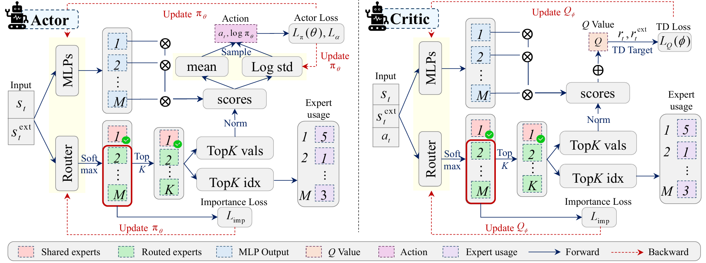

<div align="center">

# GridMoE: Learning Exogenous-Aware Mixture-of-Experts Policy for Power Grid Optimization under Dynamic Topologies and Scenarios

<p>
  <a href="LICENSE"></a>
  
  
  
  
</p>

<p>
  <a href="#overview">Overview</a> •
  <a href="#highlights">Highlights</a> •
  <a href="#task-setup">Task Setup</a> •
  <a href="#installation">Installation</a> •
  <a href="#quick-start">Quick Start</a> •
  <a href="#repository-structure">Structure</a> •
  <a href="#citation">Citation</a>
</p>



</div>

> [!NOTE]
> GridMoE targets multi-task power grid control under topology shifts and stochastic exogenous conditions. The policy builds on **Soft Actor-Critic (SAC)** and introduces **exogenous-aware Mixture-of-Experts routing** to improve specialization and generalization across heterogeneous grid regimes.

<a id="overview"></a>
## ✨ Overview

GridMoE is an open-source reinforcement learning framework for power grid optimization under changing network topologies and uncertain operating conditions. Instead of training a separate controller for each operating regime, GridMoE learns a unified policy that can route computation across experts according to the current state and exogenous signals.

This repository includes:

- **GridMoE**, the exogenous-aware MoE policy for multi-task grid control.
- **NormMoE**, a normalized MoE baseline for controlled comparison.
- **Single-task SAC**, a non-MoE baseline for per-task training.
- **IEEE-123-based environments** with dynamic topology and scenario variation.

<a id="highlights"></a>
## 🌟 Highlights

- **Exogenous-aware routing** that conditions expert selection on operational context rather than only raw observation features.
- **Top-k Mixture-of-Experts design** for scalable specialization in both actor and critic learning.
- **Multi-task formulation** spanning `5` topology modes and `4` stochastic scenario modes.
- **Clean training entry points** for GridMoE, NormMoE, and single-task SAC baselines.
- **Reproducible environment setup** through the provided [`environment.yaml`](environment.yaml).

<a id="task-setup"></a>
## 🧩 Task Setup

GridMoE organizes the benchmark as the Cartesian product of topology changes and stochastic operating scenarios:

| Axis | Count | Description |
| --- | --- | --- |
| Topology modes | 5 | Distinct grid topology configurations |
| Scenario modes | 4 | Different load / renewable / price regimes |
| Total tasks | 20 | `5 x 4` task combinations |

> [!TIP]
> Task IDs are zero-based and follow `task_id = topology_id * 4 + scenario_id`.

<a id="installation"></a>
## ⚙️ Installation

The most reliable way to reproduce the environment is to use the provided Conda file:

```bash
git clone https://anonymous.4open.science/r/GridMoE/
cd GridMoE
conda env create -n gridmoe -f environment.yaml
conda activate gridmoe
```

The pinned environment is centered around:

- Python 3.11.5
- PyTorch 2.2.2
- Gymnasium 0.29.1
- Pandapower 2.14.6
- Numba 0.61.2

> [!IMPORTANT]
> The grid builder initializes networks with `opf_mode='gurobi'` in [`envs/ieee_meta/pandapower_build_net.py`](envs/ieee_meta/pandapower_build_net.py). To reproduce the environment behavior as-is, prepare a working **Gurobi** installation and license.

If you prefer a manual setup, mirror the package versions in [`environment.yaml`](environment.yaml).

<a id="quick-start"></a>
## 🚀 Quick Start

The training scripts infer the number of parallel environments from `len(train_tasks)`, so pass one task ID per environment.

<details open>
<summary><strong>Train GridMoE</strong></summary>

```bash
python sac_gridmoe.py \
  --exp_name gridmoe_mix40_topk4_h4 \
  --mix-num 40 \
  --topk 4 \
  --horizon 4 \
  --seed 0 \
  --train-tasks 0 1 2 3 \
  --test-tasks 0 1 2 3 \
  --total-timesteps 4000000
```

</details>

<details>
<summary><strong>Train NormMoE</strong></summary>

```bash
python sac_normmoe.py \
  --exp_name normmoe_mix40_topk4_h4 \
  --mix-num 40 \
  --topk 4 \
  --horizon 4 \
  --seed 0 \
  --train-tasks 0 1 2 3 \
  --test-tasks 0 1 2 3 \
  --total-timesteps 4000000
```

</details>

<details>
<summary><strong>Train Single-Task SAC</strong></summary>

```bash
python sac_single.py \
  --exp_name single_task \
  --horizon 4 \
  --seed 0 \
  --train-tasks 0 \
  --test-tasks 0 \
  --total-timesteps 4000000
```

</details>

### 🔎 Main Entry Points

| Script | Method | Purpose |
| --- | --- | --- |
| `sac_gridmoe.py` | GridMoE | Exogenous-aware MoE policy training |
| `sac_normmoe.py` | NormMoE | Normalized MoE baseline |
| `sac_single.py` | Single-task SAC | Per-task baseline |

By default, the training scripts enable Weights & Biases logging in offline mode. Set `WANDB_API_KEY` if you want to sync runs online.

<a id="repository-structure"></a>
## 📁 Repository Structure

```text
GridMoE/
|- envs/
|  `- ieee_meta/
|     |- ieee123_meta_env_v1.py      # Core meta-environment
|     |- ieee123_rl_env_v1.py        # RL wrapper and vectorized env API
|     |- pandapower_build_net.py     # IEEE-123 grid construction
|     |- shmem_vec_env.py            # Shared-memory vectorized environment
|     `- task_set/                   # Topology and scenario data
|- safepo/                           # Shared RL utilities and logging helpers
|- model_ensemble.py                 # Supporting model components
|- sac_gridmoe.py                    # GridMoE training entry
|- sac_normmoe.py                    # NormMoE baseline entry
|- sac_single.py                     # Single-task SAC baseline entry
|- utils.py                          # Utility helpers
|- environment.yaml                  # Reproducible software environment
|- image.png                         # Method overview figure
`- README.md
```

<a id="citation"></a>
## 📚 Citation

If you use this code in your research, please cite:

```bibtex
@article{gridmoe2026,
  title={GridMoE: Learning Exogenous-Aware Mixture-of-Experts Policy for Power Grid Optimization under Dynamic Topologies and Scenarios},
  author={Anonymous Authors},
  journal={IEEE Transactions on Industrial Informatics},
  year={2026}
}
```

## 📄 License

This project is released under the MIT License. See [LICENSE](LICENSE) for details.

## 🙏 Acknowledgments

- Built on top of [CleanRL](https://github.com/vwxyzjn/cleanrl) for SAC-style training structure.
- Uses [Pandapower](https://github.com/e2nIEE/pandapower) for power system simulation.
